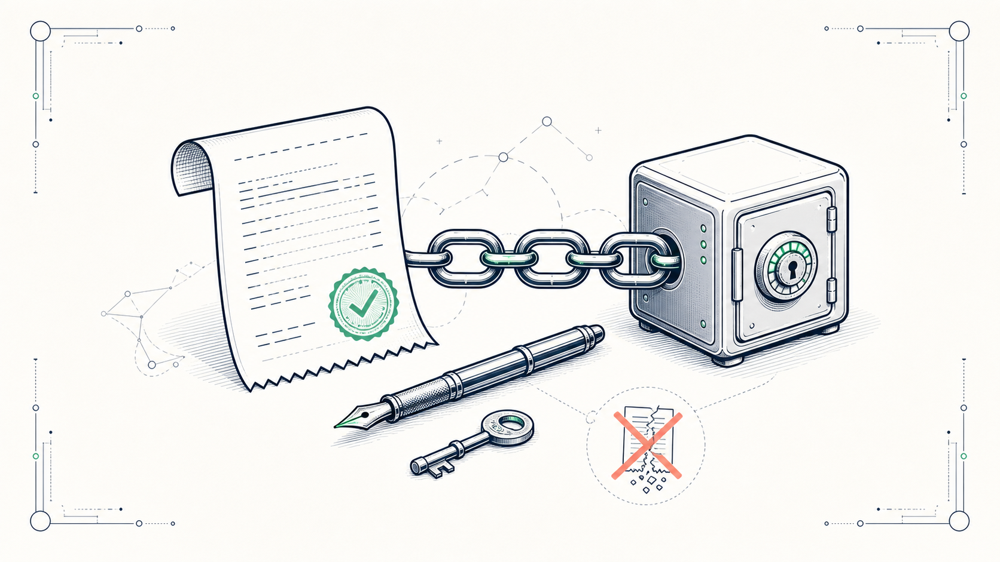
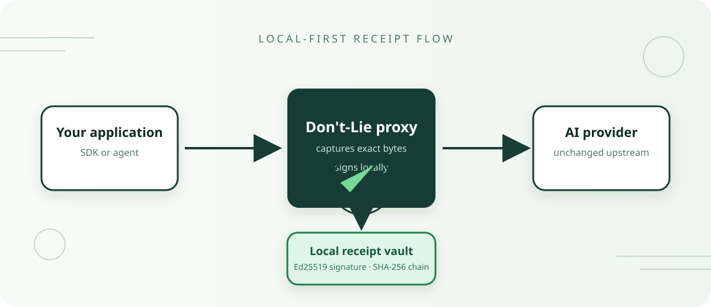
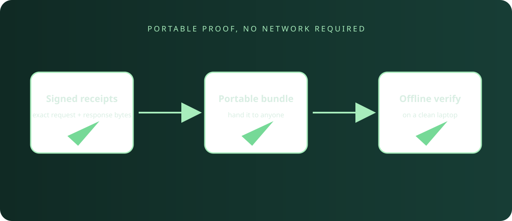

# Don't-Lie

> **The receipts your AI should have been generating.**
> A drop-in proxy that signs every AI call, hash-links it to the last one, and lets anyone verify it offline on a clean machine.

[](LICENSE)
[](https://www.python.org)
[](https://github.com/Matrix-ops77/dont-lie/actions/workflows/ci.yml)
[](#how-it-works)
[](#how-it-works)
[](#philosophy)



---

```bash
python -m pip install https://github.com/Matrix-ops77/dont-lie/releases/download/v0.3.6/dontlie-0.3.6-py3-none-any.whl
dontlie demo
```

That's it. 30 seconds. No API keys. A signed receipt chain you can tamper with to verify it actually catches tampering.

---

## Primary workflow: produce buyer evidence

Turn the current local receipt vault into one portable packet:

```bash
dontlie prove customer-evidence
cd customer-evidence
shasum -a 256 -c SHA256SUMS
dontlie verify --export receipts.bundle.json --verbose
```

The command verifies the source chain, exports and re-verifies the portable
bundle, then atomically publishes `receipts.bundle.json`,
`receipt-report.html`, `manifest.json`, `SHA256SUMS`, and `VERIFY.txt`. It
refuses an empty or invalid vault and will not overwrite a nonempty directory.

The packet's claims are deliberately limited:

- Chain integrity is verified.
- Signer identity requires external key pinning.
- Provider identity is recorded, not independently attested.
- Answer truth is not evaluated.

---

## What it is

A local-first proxy that captures every AI request and response into a **signed, hash-linked receipt chain**. Ed25519 signatures. SHA-256 chain. Offline verification. Portable bundle. No false claims.

```python
# Before
openai.api_base = "https://api.openai.com/v1"

# After (one line)
openai.api_base = "http://localhost:8080/v1"
```

Your client doesn't change. Your provider doesn't change. Every call now produces a receipt you can hand to an auditor.

---

## What it proves — and what it doesn't

| Proved | Not proved |
|---|---|
| The receipt was signed by the documented key | Whether the model answer is correct |
| The chain is unbroken from the first receipt | Whether the upstream provider is the one claimed |
| The bundle matches the receipts you handed over | Which person or organization held the signing key |
| Each receipt binds the exact bytes you sent and received | Content semantics beyond the bytes |

The wedge is honesty. We don't claim AI is truthful. We claim the record is tamper-evident.

---

## Features

- **Ed25519-signed receipts** — held locally, no phone-home
- **Hash-linked chain (v2)** — each receipt SHA-256-links to the previous
- **OpenAI-compatible proxy** — drop-in for OpenAI, Anthropic, MiniMax, LangChain, LlamaIndex
- **Portable signed bundles** — verify offline on a clean machine
- **HTML proof report** — self-contained, beautifully formatted
- **Secret redaction** — API keys, emails, SSNs, credit cards, JWTs
- **Works with 200+ models** — OpenAI, Anthropic, MiniMax, Gemini, Llama, Mistral, any local
- **30-second install** — no Docker, no cloud, no accounts
- **MIT licensed** — the whole thing
- **Trust score** — 0-100 number from the existing vault state, JSON for CI
- **NDJSON streaming** — `dontlie tail --follow --json` for Splunk / Datadog / ELK / Sumo
- **Web UI** — `dontlie web` for non-engineer auditors (stdlib HTTP, no JS deps)
- **TUI explorer** — `dontlie ui` for receipt browsing over SSH
- **One-line agent SDK** — `import dontlie_agent; dontlie_agent.install()`
- **Operator reference memos** — informational notes on HIPAA, SOC 2, EU AI Act, NY DFS, CFPB, Colorado ADMT, FDA PCCP, and FedRAMP in `docs/compliance/`. These are operator-facing reference material, **not** vendor certifications and not legal advice.

---

## How it works



1. Point any OpenAI-compatible client at `http://localhost:8080/v1`
2. Don't-Lie forwards the request and captures the exact request/response
3. Each receipt is SHA-256 hashed, Ed25519 signed, and linked to the previous
4. Verify offline with `dontlie verify`
5. Export a portable bundle with `dontlie export --bundle`
6. Render an HTML proof report (the demo script does this automatically; the helper is also exposed as `python3 -m dontlie.demo.render_report`)

### Verify anywhere



---

## Use cases

**Incident response** — your customer asks "what did the AI actually say?" Produce a one-page proof report in 30 seconds instead of digging through logs.

**Compliance & audit** — hand auditors a signed chain of evidence that survives any local machine change. The `docs/compliance/` memos explain which regime a receipt helps with and which parts of the regime are still the operator's job. They are not certifications and not legal advice.

**Customer trust** — show your customers exactly what their data became, that you didn't change it, and which provider answered. Independently verifiable.

**Provider migration** — switch from OpenAI to Anthropic to local models without losing your audit history.

**Forensic debugging** — every prompt, every response, every byte, every signature. Tamper one byte and verification fails.

---

## Install

```bash
python -m pip install https://github.com/Matrix-ops77/dont-lie/releases/download/v0.3.6/dontlie-0.3.6-py3-none-any.whl
```

Verify the install:

```bash
dontlie --version
dontlie demo                  # offline proof: 3 signed receipts, tamper + restore
dontlie demo --port 9879     # same demo on a non-default proxy port
```

30-second offline demo:

```bash
dontlie demo
```

This runs a local mock provider, captures 3 receipts, verifies them, tampers with one, and shows you exactly what fails.

Live demo with MiniMax:

```bash
export DONTLIE_UPSTREAM_BASE_URL=https://api.minimax.io/v1
export DONTLIE_UPSTREAM_API_KEY="$MINIMAX_API_KEY"
dontlie proxy --port 8080 &

export OPENAI_BASE_URL=http://127.0.0.1:8080/v1
export OPENAI_API_KEY=dontlie-local

# Talk to any OpenAI-compatible client. Receipts are written automatically.
```

---

## Architecture

```
dontlie/
├── storage.py          # SQLite vault, chain v2, append
├── sign.py             # Ed25519 signing, key management
├── proxy.py            # OpenAI- and Anthropic-compatible HTTP proxy
├── verify.py           # Offline verification, bundle export
├── render_report.py    # HTML proof report
├── redaction.py        # Secret detection and redaction
├── encryption.py       # Encrypted-at-rest vault option
├── groundtruth/        # Receipt ↔ source bytes reconciliation
├── anchor/             # External timestamp anchoring
├── demo/               # Offline + live runbooks
├── site/
│   ├── index.html      # Single-page project landing (local-first, MIT)
│   └── demo.html       # Browser Proof Lab (WebCrypto + IndexedDB, offline)
└── tests/              # unit, integration, browser, and release checks
```

---

## Pages

- [🏠 `site/index.html`](site/index.html) — single-page landing (local-first, MIT, no hosted service)
- [🎬 `site/demo.html`](site/demo.html) — Browser Proof Lab, 100% offline interactive proof

---

## Pricing (v0.3.x — local-first only)

There is no hosted service. There are no paid tiers. v0.3.6 is a single MIT-licensed Python package.

| What you get | Where it lives |
|---|---|
| The local-first product | Install the wheel from [GitHub Releases](https://github.com/Matrix-ops77/dont-lie/releases) |
| The signing key | Your machine, in `~/.config/dontlie/keys/` |
| The vault | Your machine, in `~/.local/share/dontlie/vault.db` (or `DONTLIE_DB`) |
| The receipt chain | Local SQLite, hash-linked, Ed25519-signed |
| The bundle for outside review | A JSON file you hand to a third party |

**The local-first product is and will remain MIT-licensed.** If a hosted service ever ships, it will be a separate product with a separate name, separate terms, and a separate page. It will not retroactively change the MIT-licensed local-first product, and it will not paywall what already works on your hardware.

---

## Benchmarks

Measured via `python3 -m dontlie.demo.benchmark 5000` on Apple M-class
hardware, Python 3.10, dontlie 0.3.4, single-threaded. Numbers are
rounded conservatively and re-run by anyone with
`python3 -m dontlie.demo.benchmark`:

| Operation | Throughput | Notes |
|---|---|---|
| Sign + store | ~380 receipts/sec | p50 latency ~2.1 ms, p95 ~5.1 ms |
| Verify chain | ~3,000 receipts/sec | 12,003 receipts verified in the captured run |
| Export JSONL | ~15,000 rows/sec | 10 MB written for 12,003 rows (~830 B/receipt) |
| HTML report render | ~29,000 receipts/sec | 2.3 MB self-contained HTML, no external assets |

Full machine-pinned transcript:
[demo/output/benchmark.transcript.json](demo/output/benchmark.transcript.json)

---

## Documentation

- [LAUNCH.md](LAUNCH.md) — customer-facing release notes
- [competitive.md](competitive.md) — public landscape and positioning
- [PRIVACY.md](PRIVACY.md) — privacy commitments (redaction, evidence modes, anchor manifests)
- [security.md](security.md) — threat model and reporting
- [PLDG.md](PLDG.md) — No-Phone-Home pledge (enforced by `test_phone_home.py`)
- [docs/compliance/](docs/compliance/) — operator reference memos (informational, not legal advice)
- [company/BRAND.md](company/BRAND.md) — style guide
- [company/PRIVACY_POLICY.md](company/PRIVACY_POLICY.md)
- [company/TERMS_OF_SERVICE.md](company/TERMS_OF_SERVICE.md)
- [company/DPA.md](company/DPA.md) — Data Processing Agreement template

---

## Run the local site

The `site/` folder is two static HTML files. There is no hosted site today.
If you want to open them locally:

```bash
open site/index.html     # macOS — the single landing page
open site/demo.html      # macOS — the offline Browser Proof Lab
```

Both pages are self-contained: no CDN fetches, no analytics, no
third-party fonts. See [PLDG.md](PLDG.md) for the no-phone-home
pledge and the enforcement test that runs in CI.

The Browser Proof Lab is the strongest public surface for v0.3.6:
Ed25519 signing, IndexedDB vault, and receipt verification all run
in the browser via WebCrypto. The CSP header refuses every
non-`self` connection, so opening the file on an air-gapped
laptop gives the same proof as opening it online.

---

## Philosophy

> **The local-first product is MIT-licensed and will stay that way.** Integrity, signer, provider, and chain verification are free in the local-first software today and will remain free in the local-first software tomorrow. A hosted service may eventually add operational conveniences on top, but it cannot paywall what already works on your hardware, because the wedge is honesty about the proof, and honesty is not a paid feature.

Don't-Lie is a notary, not a judge. We record what the model said. We don't claim it was right. That narrower claim is defensible in court, in audit, and in your customer's security review.

---

## Contributing

See [CONTRIBUTING.md](CONTRIBUTING.md). Issues: [GitHub Issues](https://github.com/Matrix-ops77/dont-lie/issues).

---

## Security

See [security.md](security.md). To report a vulnerability, open a private
issue or contact the maintainer via the email listed in
[security.md](security.md).

---

## License

MIT.

---

## Links

- [GitHub](https://github.com/Matrix-ops77/dont-lie)
- [Issues](https://github.com/Matrix-ops77/dont-lie/issues)
- [Releases](https://github.com/Matrix-ops77/dont-lie/releases)
- [Discussions](https://github.com/Matrix-ops77/dont-lie/discussions)
